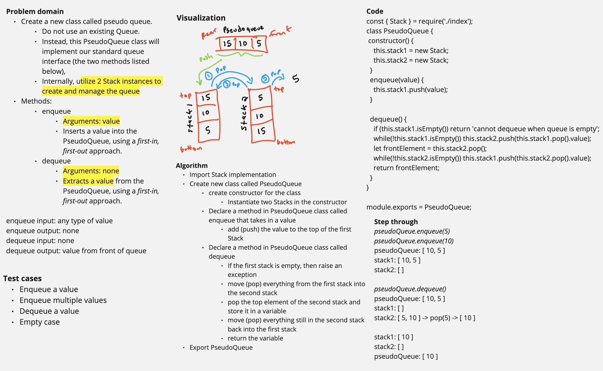

# Implementation: Stacks and Queues

## Code Challenge 10

Using a Linked List as the underlying data storage mechanism, implement both a Stack and a Queue

Node

- Create a Node class that has properties for the value stored in the Node, and a pointer to the next node.

Stack

- Create a Stack class that has a top property. It creates an empty Stack when instantiated.
- This object should be aware of a default empty value assigned to top when the stack is created.
- The class should contain the following methods:

  - push

        Arguments: value
        adds a new node with that value to the top of the stack with an O(1) Time performance.

  - pop

        Arguments: none
        Returns: the value from node from the top of the stack
        Removes the node from the top of the stack
        Should raise exception when called on empty stack

  - peek

        Arguments: none
        Returns: Value of the node located at the top of the stack
        Should raise exception when called on empty stack

  - is empty

        Arguments: none
        Returns: Boolean indicating whether or not the stack is empty.

Queue

- Create a Queue class that has a front property. It creates an empty Queue when instantiated.
- This object should be aware of a default empty value assigned to front when the queue is created.
- The class should contain the following methods:

  - enqueue

    - Arguments: value
    - adds a new node with that value to the back of the queue with an O(1) Time performance.

  - dequeue

    - Arguments: none
    - Returns: the value from node from the front of the queue
    - Removes the node from the front of the queue
    - Should raise exception when called on empty queue

  - peek
    - Arguments: none
    - Returns: Value of the node located at the front of the queue
    - Should raise exception when called on empty stack

  - is empty
    - Arguments: none
    - Returns: Boolean indicating whether or not the queue is empty

## Code Challenge 11

Create a new class called pseudo queue.
Do not use an existing Queue.
Instead, this PseudoQueue class will implement our standard queue interface (the two methods listed below),
Internally, utilize 2 Stack instances to create and manage the queue.

Methods:

- enqueue
  - Arguments: value
  - Inserts a value into the PseudoQueue, using a first-in first-out approach.

- dequeue
  - Arguments: none
  - Extracts a value from the PseudoQueue, using a first-in, first-out approach.

## Code Challenge 12

Create a class called AnimalShelter which holds only dogs and cats.
The shelter operates using a first-in, first-out approach.
Implement the following methods:

- enqueue

  - Arguments: animal
  - animal can be either a dog or a cat object.
  - It must have a species property that is either "cat" or "dog"
  - It must have a name property that is a string.

- dequeue

  - Arguments: pref
  - pref can be either "dog" or "cat"
  - Return: either a dog or a cat, based on preference.
  - If pref is not "dog" or "cat" then return null.

## Code Challenge 13

Write a function called validate brackets

- Arguments: string
- Return: boolean
  - representing whether or not the brackets in the string are balanced
- There are 3 types of brackets:
  - Round Brackets: ()
  - Square Brackets: []
  - Curly Brackets: {}

### Whiteboard Process

Challenge 11:

### Approach & Efficiency

Challenge 10: I read about stacks and queues and looked at diagrams of what they visually looked like. I kept FILO and LIFO (stacks), and FIFO and LILO (queues) in mind. Then I wrote tests. The Big O for all the methods are O(1) for space and time because they all take a constant amount of time and space.

Challenge 11: I instantiated 2 stacks in the constructor of the psuedo queue. For enqueuing, I added to one of the stacks and for dequeuing I transferred all the nodes in 1 stack to the other, popped the top value, then put them all back into the original stack. The time complexity would be O(n) because I use a while loop to do this. The space complexity would be O(n) because the additional space (the stacks) grows linearly based on the size of the queue.

Challenge 12: I instantiated 2 queues in the constructor of the animal shelter. One for dogs and one for cats. I added to the queues depending on the type of animal, and then dequeued only from the queue of the animal that was preferred. I believe the time complexity is O(1) and the space complexity is O(n).

Challenge 13: I added the front brackets in the inputted string into a stack and then compared the rear brackets in the string to the values I popped out of the stack. The time complexity and space complexity are both O(n) because the function loops n times depending on how long the inputted string is and the stack used fills up with n items depending on how many front brackets there are in the inputted string.

### Solution

Challenge 10: Run my code by making an instance of the Stack and/or Queue class I made. Then you can use the methods I made for the class and console.log the outputs if the method returns anything. Example:

    const Stack = require('./index');
    const stack = new Stack();
    stack.push(5);
    stack.push(10);
    console.log('output:' stack.pop().value);
    // output: 10

Challenge 11: Make instance of PseudoQueue class. Then use the `enqueue(value)` and `dequeue()` methods on it.

Challenge 12: Make instance of AnimalShelter class. Make instance(s) of Animal class. Then use the `enqueue(animal)` and `dequeue(pref)` methods on the AnimalShelter to add or remove Animals.

Challenge 13: Call the `validateBracket()` function with a string parameter and then `console.log()` the output.

[Link to code for challenge 10](index.js)

[Link to code for challenge 11](PseudoQueue.js)

[Link to code for challenge 12](AnimalShelter.js)

[Link to code for challenge 13](validateBrackets.js)
